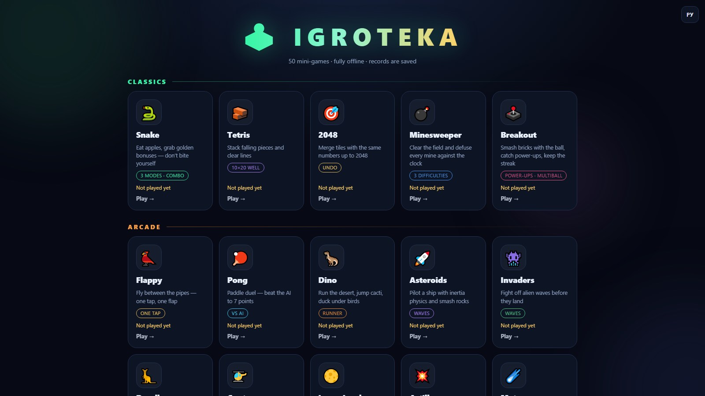

<div align="center">



# 🕹️ IGROTEKA

**15 mini-games in pure JavaScript. Neon hub, two languages, records, sound — and zero dependencies.**

[](https://xispx.github.io/Igroteka/)


</div>

**Language / Язык:** **[Русский](README.md)** · English

---

## 🎮 Play

**Online** — open [**xispx.github.io/Igroteka**](https://xispx.github.io/Igroteka/) and pick a game.

**Locally** — download the repository and double-click `index.html`: the project runs
without a server and without any build step. If you prefer a local server:

```bash
python -m http.server 8000
# → http://localhost:8000
```

## ✨ Highlights

| | |
| --- | --- |
| 🗂 **Single hub** | All 15 games on one page: sections, descriptions, records right on the cards |
| 🌐 **Two languages** | Russian and English — a switcher on the main page, the choice is remembered |
| 🌗 **Neon theme** | Dark background, glowing accents, smooth animations — custom design, no frameworks |
| 🏆 **Records** | localStorage per game: points, moves, wins, time |
| 🔊 **Sound** | Synthesized with the Web Audio API — not a single audio file, mute with `M` |
| 📜 **Rules** | Every game has a rules screen with full controls description |
| 📱 **Responsive** | Keyboard, mouse and swipes; auto-pause when the tab is hidden |

## 🖼 Screenshots

| Snake | Tetris | 2048 |
| --- | --- | --- |
|  |  |  |

## 🎯 Game catalog

### Classics

| Game | Description | Features |
| --- | --- | --- |
| 🐍 **[Snake](games/zmeyka/index.html)** | Eat apples, catch golden bonuses — don't bite yourself | 3 modes · combo |
| 🧱 **[Tetris](games/tetris/index.html)** | Stack falling pieces and clear lines | 10×20 well |
| 🎯 **[2048](games/2048/index.html)** | Merge tiles with equal numbers up to 2048 | undo |
| 💣 **[Minesweeper](games/saper/index.html)** | Clear the field and defuse every mine against the clock | 3 difficulties |
| 🕹️ **[Breakout](games/arkanoid/index.html)** | Smash bricks with the ball, catch power-ups, keep the streak | power-ups · multiball |

### Arcade

| Game | Description | Features |
| --- | --- | --- |
| 🐦 **[Flappy](games/flappy/index.html)** | Fly between the pipes — one tap, one flap | one tap |
| 🏓 **[Pong](games/pong/index.html)** | Paddle duel — beat the AI to 7 points | vs AI |
| 🦖 **[Dino](games/dino/index.html)** | Run the desert, jump cacti, duck under birds | runner |
| 🚀 **[Asteroids](games/asteroids/index.html)** | Pilot a ship with inertia physics and smash rocks | waves |

### Logic & Board

| Game | Description | Features |
| --- | --- | --- |
| 🔢 **[15 Puzzle](games/fifteen/index.html)** | Sort the tiles in order in as few moves as possible | puzzle |
| ⭕ **[Tic-tac-toe](games/tictac/index.html)** | Beat the unbeatable AI — or hold it to a draw | vs AI |
| ⚫ **[Reversi](games/reversi/index.html)** | Sandwich AI discs, flip them and take over the board | vs AI |

### Reaction & Skills

| Game | Description | Features |
| --- | --- | --- |
| 🃏 **[Memory](games/pairs/index.html)** | Find every matching pair, memorizing positions | memory |
| 🔨 **[Whack-a-Mole](games/moles/index.html)** | 30 seconds to whack as many moles as you can | reaction |
| 🎵 **[Simon](games/simon/index.html)** | Memorize and repeat the growing note sequence | memory · sound |

## 🧩 Architecture

```
index.html            — main page (4 sections, 15 cards)
css/common.css        — shared theme: header, HUD, overlays, buttons
css/hub.css           — main page styles
js/audio.js           — sound engine on the Web Audio API
js/rules.js           — «Rules» button and overlay
js/hub.js             — records on the main-page cards
js/i18n.js            — RU/EN switcher and live UI translation
js/lang-en.js         — English dictionary
games/<name>/         — game folder: index.html + css/style.css + js/game.js
```

Russian is the source language of the UI: the strings in the markup are Russian, and
`js/lang-en.js` holds their English counterparts. Translation is applied to the DOM
automatically — including overlays games create at runtime. Every game is
self-contained: its own markup and styles; shared only the sound (`js/audio.js`),
the rules overlay (`js/rules.js`) and the records for the main page (`js/hub.js`).

## 🛠 Technologies

- **HTML5 Canvas** — all graphics are drawn in code, no sprites or images
- **Web Audio API** — sounds are synthesized on the fly
- **localStorage** — records and settings
- Zero dependencies, zero build, zero network requests

## 📄 License

[MIT](LICENSE) — play, study and take it with you.
