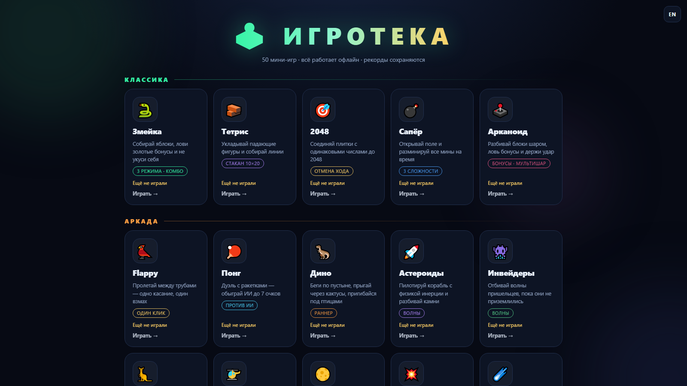
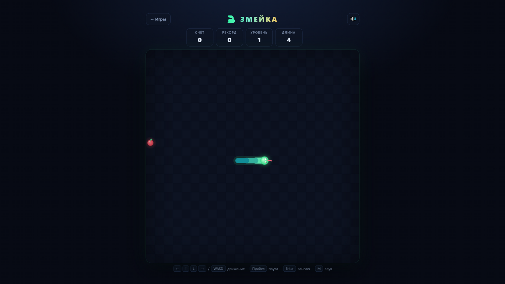
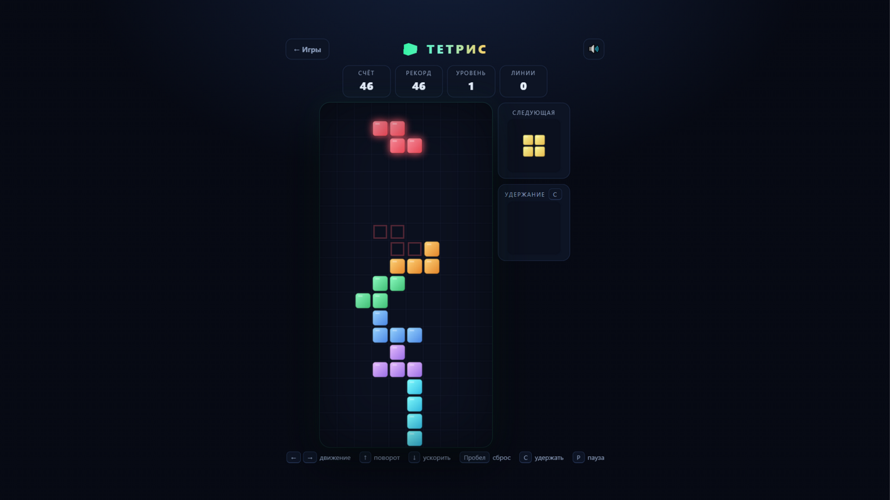
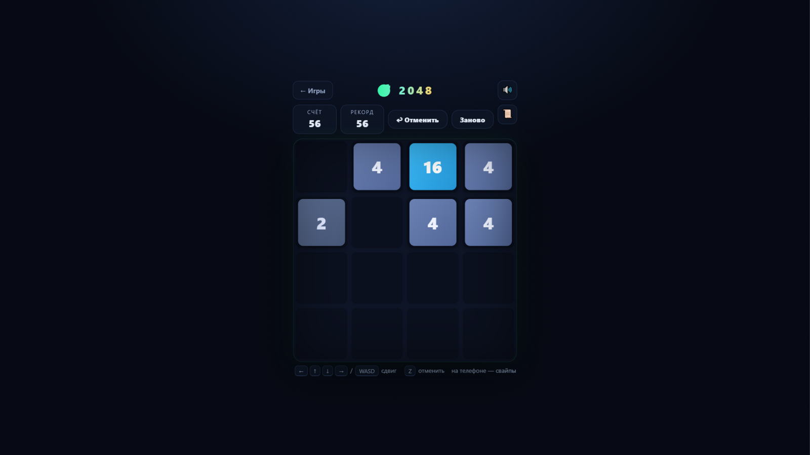

<div align="center">



# 🕹️ ИГРОТЕКА

**50 мини-игр на чистом JavaScript. Неоновый hub, два языка, рекорды, звук — и ни одной зависимости.**

[](https://xispx.github.io/igroteka/)


</div>

---

## 🎮 Играть

**Онлайн** — откройте [**xispx.github.io/igroteka**](https://xispx.github.io/igroteka/) и выберите игру.

**Локально** — скачайте репозиторий и откройте `index.html` двойным кликом: проект работает
без сервера и без сборки. При желании можно поднять локальный сервер:

```bash
python -m http.server 8000
# → http://localhost:8000
```

## ✨ Что внутри

| | |
| --- | --- |
| 🗂 **Единый hub** | Все 50 игр на одной главной: разделы, описания, рекорды прямо на карточках |
| 🌐 **Два языка** | Русский и английский — переключатель в каждой игре, выбор запоминается |
| 🌗 **Неоновая тема** | Тёмный фон, светящиеся акценты, плавные анимации — свой дизайн без фреймворков |
| 🏆 **Рекорды** | localStorage отдельно для каждой игры: очки, ходы, победы, время |
| 🔊 **Звук** | Синтезируется на Web Audio API — ни одного аудиофайла, выключается клавишей `M` |
| 📜 **Правила** | В каждой игре есть экран правил с полным описанием управления |
| 📱 **Адаптивность** | Клавиатура, мышь и свайпы; авто-пауза при сворачивании вкладки |

## 🖼 Скриншоты

| Змейка | Тетрис | 2048 |
| --- | --- | --- |
|  |  |  |

## 🎯 Каталог игр

### Классика

| Игра | Описание | Особенности |
| --- | --- | --- |
| 🐍 **[Змейка](games/zmeyka/index.html)** | Собирай яблоки, лови золотые бонусы и не укуси себя | 3 режима · комбо |
| 🧱 **[Тетрис](games/tetris/index.html)** | Укладывай падающие фигуры и собирай линии | стакан 10×20 |
| 🎯 **[2048](games/2048/index.html)** | Соединяй плитки с одинаковыми числами до 2048 | отмена хода |
| 💣 **[Сапёр](games/saper/index.html)** | Открывай поле и разминируй все мины на время | 3 сложности |
| 🕹️ **[Арканоид](games/arkanoid/index.html)** | Разбивай блоки шаром, ловь бонусы и держи удар | бонусы · мультишар |

### Аркада

| Игра | Описание | Особенности |
| --- | --- | --- |
| 🐦 **[Flappy](games/flappy/index.html)** | Пролетай между трубами — одно касание, один взмах | один клик |
| 🏓 **[Понг](games/pong/index.html)** | Дуэль с ракетками — обыграй ИИ до 7 очков | против ИИ |
| 🦖 **[Дино](games/dino/index.html)** | Беги по пустыне, прыгай через кактусы, пригибайся под птицами | раннер |
| 🚀 **[Астероиды](games/asteroids/index.html)** | Пилотируй корабль с физикой инерции и разбивай камни | волны |
| 👾 **[Инвейдеры](games/invaders/index.html)** | Отбивай волны пришельцев, пока они не приземлились | волны |
| 🦘 **[Дудл](games/doodle/index.html)** | Прыгай по платформам всё выше — не падай вниз | прыжки |
| 🚁 **[Вертолёт](games/copter/index.html)** | Держи тягу и проведи винтокрылую машину через пещеру | одна кнопка |
| 🌕 **[Луна](games/moon/index.html)** | Посади лунный модуль мягко, ровно и на площадку | физика |
| 💥 **[Пушка](games/arty/index.html)** | Артиллерийская дуэль с ИИ: угол, сила и переменный ветер | дуэль |
| ☄️ **[Метеоры](games/meteors/index.html)** | Метеоритный дождь — уворачивайся как можно дольше | уклонение |
| 🏎️ **[Пробка](games/traffic/index.html)** | Лавируй между машинами на растущей скорости | 3 полосы |
| 🟢 **[Пожиратель](games/orbs/index.html)** | Ешь шары меньше себя и не попадись большим — и не таяй | аркада · рост |
| 🫧 **[Пузыри](games/bubble/index.html)** | Стреляй шаром, собирай группы из трёх и лопай | стрельба · группы |
| 🏒 **[Аэрохоккей](games/hockey/index.html)** | Забей ИИ семь шайб — ракетка следует за пальцем | против ИИ |

### Логика и настольные

| Игра | Описание | Особенности |
| --- | --- | --- |
| 🔢 **[Пятнашки](games/fifteen/index.html)** | Расставь фишки по порядку за минимум ходов | головоломка |
| ⭕ **[Крестики](games/tictac/index.html)** | Победи непобедимый ИИ — или сыграй с ним вничью | против ИИ |
| ⚫ **[Реверси](games/reversi/index.html)** | Зажимай фишки ИИ, переворачивай их и захватывай доску | против ИИ |
| 🔵 **[Соедини 4](games/connect4/index.html)** | Бросай фишки в колонки и собери четыре в ряд раньше ИИ | minimax ИИ |
| ⚫ **[Гомоку](games/gomoku/index.html)** | Пять фишек в ряд на доске 15×15 против хитрого ИИ | 15×15 |
| 🥢 **[Ним](games/nim/index.html)** | Бери палочки из рядов. Кто возьмёт последнюю — победил | идеальный ИИ |
| 🚢 **[Морской бой](games/sea/index.html)** | Потопи флот ИИ раньше, чем он потопит твой | классика |
| 🃏 **[Очко](games/bj/index.html)** | Блэкджек против дилера: набери ближе к 21 и не пережги | карты · банк |
| 🫘 **[Манкала](games/mancala/index.html)** | Сей камни по кругу и собери больше всех в свой магазин | древняя игра |
| 🔗 **[Точки](games/dots/index.html)** | Ставь линии, замыкай квадраты — очко и ещё один ход | тактика |
| 🔟 **[Судоку](games/sudoku/index.html)** | Классика 9×9 с генератором и единственным решением | на время |
| 🗼 **[Ханой](games/hanoy/index.html)** | Перенеси башню дисков на правый стержень за минимум ходов | головоломка |
| 💡 **[Выключи свет](games/lights/index.html)** | Каждый клик переключает плюс-фигуру. Погаси все лампы | головоломка |
| 💎 **[Три-в-ряд](games/match3/index.html)** | Меняй кристаллы местами, собирай линии и лови каскады | 90 секунд |
| 📦 **[Сокобан](games/sokoban/index.html)** | Толкай ящики на цели: 6 уровней, отмена хода | 6 уровней |
| 🌈 **[Поток](games/flow/index.html)** | Соедини пары цветных точек, заполнив всё поле | 6×6 · 12 уровней |
| 🔐 **[Код](games/code/index.html)** | Угадай комбинацию из 4 цветов за минимум попыток | логика |

### Слова

| Игра | Описание | Особенности |
| --- | --- | --- |
| 🎯 **[Виселица](games/hangman/index.html)** | Угадай слово по буквам, пока не кончились попытки | 7 попыток |
| 🔤 **[Слово](games/wordle/index.html)** | Угадай слово из 5 букв за 6 попыток — как в Wordle | 6 попыток |
| 🐄 **[Быки, коровы](games/bulls/index.html)** | Угадай 4 цифры: бык — на месте, корова — есть в числе | логика чисел |
| ⌨️ **[Печать](games/typing/index.html)** | Набирай фразы быстро и без ошибок — знаков в минуту | скорость |

### Реакция и навыки

| Игра | Описание | Особенности |
| --- | --- | --- |
| 🃏 **[Пара](games/pairs/index.html)** | Найди все пары одинаковых карточек, запоминая позиции | память |
| 🔨 **[Кроты](games/moles/index.html)** | 30 секунд, чтобы прихлопнуть как можно больше кротов | реакция |
| 🎵 **[Мелодия](games/simon/index.html)** | Запоминай и повторяй растущую последовательность нот | память · звук |
| ⚡ **[Реакция](games/reaction/index.html)** | 5 раундов: как только фон зеленеет — жми | миллисекунды |
| 🎯 **[Аим](games/aim/index.html)** | 20 мишеней по одной — сбей все за минимальное время | точность |
| 🥁 **[Ритм](games/rhythm/index.html)** | Ноты падают по четырём дорожкам — лови на линии D F J K | 4 дорожки |
| 🔢 **[Цепочка](games/span/index.html)** | Запомни число и введи его — с каждым уровнем длиннее | память чисел |
| 🎨 **[Струп](games/stroop/index.html)** | Цвет или смысл? Мозг путается — победи его за 45 секунд | когнитивный |
| 🧮 **[Счёт](games/math/index.html)** | Математический спринт: чем длиннее серия — тем больше очков | 60 секунд |
| 🏗️ **[Башня](games/stack/index.html)** | Роняй блоки точно друг на друга — высота решает | одна кнопка |

## 🧩 Архитектура

```
index.html            — главная страница (5 разделов, 50 карточек)
css/common.css        — общая тема: шапка, HUD, оверлеи, кнопки
css/hub.css           — стили главной страницы
js/audio.js           — звуковой движок на Web Audio API
js/rules.js           — кнопка и оверлей «Правила»
js/hub.js             — рекорды на карточках главной
js/shell.js           — оболочка новых игр: шапка, HUD, рекорды, пауза, звук
js/i18n.js            — переключатель RU/EN и автоперевод интерфейса
js/lang-en.js         — английский словарь (генерируется из исходных строк)
games/<имя>/          — папка игры: index.html + css/ + js/game.js
```

Русский — исходный язык интерфейса: все строки в коде русские, а `js/lang-en.js`
содержит их английские пары. Перевод применяется к DOM автоматически (в том числе
к оверлеям, которые игры создают во время работы), переключатель — кнопка EN/РУ
в шапке каждой игры. В играх со словами (Виселица, Слово, Печать) вместе с языком
меняются и словари слов.

Первые 15 игр самостоятельные (собственная разметка и стили), остальные построены на
общей оболочке `Shell.init({...})`: конфиг задаёт название, статы и хуки, а игра
реализует только логику. Новый холст — `Shell.canvas()`, рекорды — `Shell.tryRecord()`.

## 🛠 Технологии

- **HTML5 Canvas** — вся графика рисуется кодом, спрайтов и картинок нет
- **Web Audio API** — звуки синтезируются на лету
- **localStorage** — рекорды и настройки
- Ноль зависимостей, ноль сборки, ноль запросов в сеть

## 📄 Лицензия

[MIT](LICENSE) — играйте, изучайте и забирайте себе.
